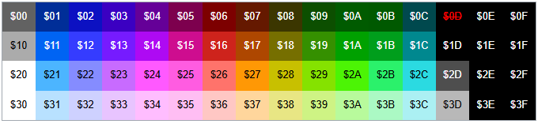

# GameConsole: Console & API Documentation

## Overview
GameConsole is a modular embedded game console platform based on the STM32F407 microcontroller. It provides a hardware abstraction layer and a rich API for game development, including graphics rendering, joystick input, sound, and asset management.

---

## Table of Contents
- [Architecture](#architecture)
- [Main Loop](#main-loop)
- [API Overview](#api-overview)
  - [System Time](#system-time)
  - [Debug/USART](#debugusart)
  - [Sound (Buzzer)](#sound-buzzer)
  - [Joystick](#joystick)
  - [Renderer](#renderer)
  - [Asset Loader](#asset-loader)
- [Module Internals](#module-internals)
  - [System/Startup](#systemstartup)
  - [Renderer](#renderer-internal)
  - [Joystick](#joystick-internal)
  - [Buzzer](#buzzer-internal)
  - [Asset Loader](#asset-loader-internal)
  - [SDIO & Filesystem](#sdio--filesystem)
  - [Interrupts & Syscalls](#interrupts--syscalls)
- [Initialization Sequence](#initialization-sequence)
- [Example Usage](#example-usage)
- [File Structure](#file-structure)
- [See Also](#see-also)
- [License](#license)

---

## Architecture
- **MCU:** STM32F407
- **Main Components:**
  - Renderer (graphics)
  - Joystick (input)
  - Buzzer (sound)
  - Asset Loader (game data)
  - SDIO (storage)
  - USART (debug)

All modules are initialized in `gameConsoleInit()`.

---

## Main Loop
The main application loop (see `main.c`) follows this structure:

```c
int main(void) {
    gameConsoleInit();
    // ... (test/init code)
    while (1) {
        update();   // Handle input, update game state
        render();   // Draw frame
        syncFrame(); // Maintain FPS
    }
}
```

- **update()**: Reads joystick state, updates sprite positions.
- **render()**: Renders the frame, handles sound triggers.
- **syncFrame()**: Ensures a fixed frame rate (default 50 FPS).

---

## API Overview
The Console API is exposed via a `ConsoleAPI` struct, making it accessible to loaded games and modules. Below is a summary of the main API groups and their functions.

### System Time
- `getSysTime()`: Returns system uptime in ms.
- `delay(ms)`: Busy-wait delay.

### Debug/USART
- `debugChar(char)`: Send a character over debug UART.
- `debugString(const char*)`: Send a string over debug UART.
- `debugInt(int)`: Send an integer as text.
- `debugHex(uint8_t)`: Send a byte as hex.
- `debugBinary(uint8_t)`: Send a byte as binary.

### Sound (Buzzer)
- `buzzerGetMaxTracks()`: Get number of sound tracks.
- `buzzerPlay(track, data, size)`: Play sound data.
- `buzzerPlayWithCallback(...)`: Play with callback.
- `buzzerPause(track)`, `buzzerResume(track)`, `buzzerStop(track)`: Control playback.

### Joystick
- `joystickGetRBtnUp/Down/Left/Right()`: Right stick buttons.
- `joystickGetLBtnUp/Down/Left/Right()`: Left stick buttons.
- `joystickGetSpecialBtn1/2()`: Special buttons.
- `joystickGetRAnalogX/Y()`, `joystickGetLAnalogX/Y()`: Analog axes.

### Renderer
- `rendererRender()`: Draw the current frame.
- `rendererSetDirtyCompleteRedraw()`: Force full redraw.
- `rendererGetWidthPixels()`, `rendererGetHeightPixels()`: Screen size.
- `rendererGetWidthTiles()`, `rendererGetHeightTiles()`: Tile grid size.
- `rendererGetTilePixelSize()`: Tile size in pixels.
- `rendererOamSetXYPos(idx, x, y)`: Set sprite position.
- `rendererOamGetXPos(idx)`, `rendererOamGetYPos(idx)`: Get sprite position.
- `rendererPatternTableSetTile(...)`, `rendererPatternTableClear()`: Tile graphics.
- `rendererFramePaletteSetSprite(...)`, `rendererFramePaletteSetBackground(...)`: Palette control.
- ...and more (see `game_console_api.h`).

### Asset Loader
- `assetLoaderGetAssetSize(asset_id, *size)`: Get asset size.
- `assetLoaderGetAssetData(asset_id, *buffer)`: Load asset data.
- `assetLoaderGetAssetHeader(*header)`: Get asset metadata.

---

## Module Internals

### System/Startup
- **SystemInit**: Configures system clock and core peripherals.
- **syscalls.c**: Implements minimal newlib system calls for embedded C runtime (e.g., `_write`, `_read`, `_exit`).
- **stm32f4xx_it.c**: Defines interrupt handlers for faults and system exceptions (NMI, HardFault, etc.).

### Renderer (renderer.c/h)
- Handles tile-based graphics rendering to the ILI9341 display.
- Manages OAM (Object Attribute Memory) for sprite positions and attributes.
- Provides palette and pattern table management for flexible graphics.
- Supports dirty rectangle redraws for performance.
- Internal functions:
  - `rendererInit()`: Initialize display and buffers.
  - `rendererRender()`: Draws the current frame.
  - `rendererOamSetXYPos()`, `rendererOamSetTileIdx()`, etc.: Manipulate sprite data.
  - `rendererPatternTableSetTile()`: Update tile graphics.
  - `rendererFramePaletteSetSprite()`: Set sprite palette.

### Joystick (joystick.c/h)
- Reads analog and digital joystick inputs via ADC and GPIO.
- Debounces and interprets button presses and analog stick positions.
- Internal functions:
  - `joystickInit()`: Configure ADC and GPIO for input.
  - `joystickGetLAnalogX/Y()`, `joystickGetRAnalogX/Y()`: Read analog axes.
  - `joystickGetLBtnUp/Down/Left/Right()`, etc.: Read button states.

### Buzzer (buzzer.c/h)
- Controls sound output for effects and music.
- Supports multiple tracks and callback-based playback.
- Internal functions:
  - `buzzerInit()`: Set up timers and output pins.
  - `buzzerPlay()`, `buzzerPause()`, `buzzerResume()`, `buzzerStop()`: Playback control.
  - `buzzerPlayWithCallback()`: Play sound and trigger callback on completion.

### Asset Loader (asset_loader.c/h)
- Loads game assets (tiles, sounds, etc.) from SD card or flash.
- Provides asset size, data, and header information to games.
- Internal functions:
  - `assetLoaderGetAssetSize()`: Query asset size by ID.
  - `assetLoaderGetAssetData()`: Load asset data into buffer.
  - `assetLoaderGetAssetHeader()`: Read asset metadata.

### SDIO & Filesystem (sdio.c/h, ff.c/h)
- Manages SD card interface and FAT filesystem.
- Internal functions:
  - `f_mount()`: Mount filesystem.
  - `sdioInit()`: Initialize SDIO hardware.
  - `ff_*()`: FATFS file operations.

### Interrupts & Syscalls
- **stm32f4xx_it.c**: All core and peripheral interrupt handlers.
- **syscalls.c**: Minimal C runtime support for embedded environment.

---

## Initialization Sequence
1. **peripheralsInit()**: Initializes SD card, DMA, GPIO, USART, Timer, LCD, ADC, Joystick, Buzzer, Renderer.
2. **gameConsoleExposeApi()**: Populates the API struct and exposes it to loaded games.

---

## Example Usage
Move a sprite with the joystick:
```c
void update() {
    uint8_t x = rendererOamGetXPos(0);
    uint8_t y = rendererOamGetYPos(0);
    if (joystickGetLAnalogX() == JoystickAnalogValueHighAxis) x += 5;
    if (joystickGetLAnalogX() == JoystickAnalogValueLowAxis)  x -= 5;
    if (joystickGetLAnalogY() == JoystickAnalogValueHighAxis) y += 5;
    if (joystickGetLAnalogY() == JoystickAnalogValueLowAxis)  y -= 5;
    rendererOamSetXYPos(0, x, y);
}
```

---

## File Structure
- `Console/Src/`: Main source files
- `Console/Inc/`: Headers
- `GameXO/`: Example game
- `Shared/`, `Tiles/`, `Assets/`: Shared resources

---

## Subdirectory Structure and Module Overview

The `Console` directory is organized into several submodules, each with its own header (`.h`) and source (`.c`) files. Here is a breakdown of the main subdirectories and their responsibilities:

### Devices
- **Files:** `buzzer.[ch]`, `ILI9341.[ch]`, `joystick.[ch]`
- **Purpose:** Low-level drivers for hardware devices.
  - `buzzer`: Sound output and control.
  - `ILI9341`: LCD display driver.
  - `joystick`: Input from analog/digital joysticks.

### Renderer
- **Files:** `renderer.[ch]`
- **Purpose:** Tile-based graphics engine, sprite/OAM management, palette and pattern table control.

### Loader
- **Files:** `asset_loader.[ch]`, `game_loader.[ch]`, `loader.[ch]`
- **Purpose:** Asset and game loading from storage. Handles asset metadata, data transfer, and game selection.

### Peripherals
- **Files:** `adc.[ch]`, `dma.[ch]`, `gpio.[ch]`, `sdio.[ch]`, `spi.[ch]`, `sysclock.[ch]`, `timer.[ch]`, `usart.[ch]`
- **Purpose:** Abstraction for microcontroller peripherals. Used by higher-level modules for hardware access.

### FatFs
- **Files:** `diskio.[ch]`, `diskio_integration.[ch]`, `ff.[ch]`, `ffconf.h`, `ffunicode.c`
- **Purpose:** FAT filesystem support for SD card storage. Integrates with SDIO and provides file access to games and assets.

---

Each submodule is designed for separation of concerns, making the codebase modular and maintainable. For more details, see the respective header files in each subdirectory.

---

## See Also
- `game_console_api.h`: Full API definition
- `main.c`: Main application logic
- `game_console.c`: API exposure and initialization

---

## License
See `README.md` for license and authorship.

---

## Module Internals and Example Usages

### Devices
#### Buzzer
- **Purpose:** Sound output for effects and music.
- **Key Defines:** Musical note frequencies (e.g., `NOTE_C4`, `NOTE_D4`, ...).
- **Key Functions:**
  - `buzzerInit()`: Initialize hardware.
  - `buzzerPlay(track, data, size)`: Play a sequence of notes.
  - `buzzerPause(track)`, `buzzerResume(track)`, `buzzerStop(track)`: Playback control.
- **Usage Example:**
  ```c
  buzzerPlay(0, melody_data, melody_size);
  buzzerPause(0);
  buzzerResume(0);
  buzzerStop(0);
  ```

#### Joystick
- **Purpose:** Read analog and digital joystick input.
- **Key Types:**
  - `JoystickAnalogValue` enum: `Off`, `LowAxis`, `HighAxis`.
- **Key Functions:**
  - `joystickInit()`: Initialize ADC/GPIO.
  - `joystickGetLAnalogX/Y()`, `joystickGetRAnalogX/Y()`: Analog axes.
  - `joystickGetLBtnUp/Down/Left/Right()`, etc.: Button states.
- **Usage Example:**
  ```c
  if (joystickGetLBtnUp()) { /* move up */ }
  if (joystickGetRAnalogX() == JoystickAnalogValueHighAxis) { /* move right */ }
  ```

#### ILI9341 (LCD)
- **Purpose:** Low-level LCD display driver.
- **Key Defines:** Color constants (e.g., `ILI9341_BLACK`, `ILI9341_WHITE`), screen size.
- **Key Functions:**
  - `ili9341Init(rotation, width, height)`: Initialize display.
  - `ili9341DrawPixel(x, y, color)`: Draw a pixel.
  - `ili9341FillScreen(color)`, `ili9341FillRectangle(...)`: Fill areas.
  - `ili9341DrawImage(x, y, w, h, data)`: Draw image.
- **Usage Example:**
  ```c
  ili9341FillScreen(ILI9341_BLACK);
  ili9341DrawPixel(10, 10, ILI9341_RED);
  ```

### Renderer
- **Purpose:** Tile-based graphics, sprite/OAM, palette, and pattern table management.
- **Key Functions:**
  - `rendererInit()`: Initialize renderer.
  - `rendererRender()`: Draw frame.
  - `rendererSetDirtyCompleteRedraw()`: Force full redraw.
  - `rendererOamSetXYPos(idx, x, y)`: Set sprite position.
  - `rendererPatternTableSetTile(idx, data, size)`: Set tile graphics.
  - `rendererFramePaletteSetSprite(...)`: Set sprite palette.
- **Usage Example:**
  ```c
  rendererOamSetXYPos(0, 20, 30);
  rendererPatternTableSetTile(1, tile_data, 16);
  rendererRender();
  ```

### Loader
#### Asset Loader
- **Purpose:** Load assets (tiles, sounds, etc.) from storage.
- **Key Functions:**
  - `assetLoaderGetAssetSize(asset_id, *size)`: Get asset size.
  - `assetLoaderGetAssetData(asset_id, *buffer)`: Load asset data.
  - `assetLoaderGetAssetHeader(*header)`: Get asset metadata.
- **Usage Example:**
  ```c
  uint32_t size;
  assetLoaderGetAssetSize(15, &size);
  uint8_t buffer[size];
  assetLoaderGetAssetData(15, buffer);
  ```

#### Game Loader
- **Purpose:** Load and manage game binaries.
- **Key Functions:**
  - `gameLoaderLoadGame(index)`: Load game by index.
  - `gameLoaderGetHeader(*header)`: Get game metadata.
  - `gameLoaderCloseGame()`: Unload game.
- **Usage Example:**
  ```c
  gameLoaderLoadGame(0);
  GameHeader header;
  gameLoaderGetHeader(&header);
  gameLoaderCloseGame();
  ```

#### Loader (File Loader)
- **Purpose:** File access and management for game binaries.
- **Key Functions:**
  - `loaderOpenFile(index)`: Open file by index.
  - `loaderGetFile()`: Get file handle.
  - `loaderCloseFile()`: Close file.
  - `loaderIsFileOpened()`: Check if file is open.
  - `loaderGetBinaryFilesNumberInDirectory()`: Count binaries.
  - `loaderGetFilenameByIndex(index, *out, *len)`: Get filename.
- **Usage Example:**
  ```c
  loaderOpenFile(0);
  FIL *file = loaderGetFile();
  loaderCloseFile();
  ```

# Renderer: Full Documentation and Drawing Guide

## Overview
The renderer is a tile-based, palette-driven graphics engine inspired by classic consoles. It supports background and sprite layers, tile flipping, palette selection, and priority control. The renderer is optimized for embedded systems and uses a dirty-tile system for efficient redraws.

## Graphics Model
- **Screen Size:** 256x240 pixels (16x16 pixel tiles, 16x15 tiles)
- **Tiles:** 16x16 pixels, 64 bytes per tile, up to 256 unique tiles (pattern table)
- **Sprites:** Up to 64 sprites (OAM entries), each using a tile and palette
- **Palettes:**
  - 64 system colors (RGB565)
  - 16 frame palettes for sprites, 16 for background, each with 4 colors (index 0 is transparent)
- **Layers:**
  - Background (tilemap, per-tile palette, flip, priority)
  - Sprites (OAM, per-sprite palette, flip, priority)

## Data Structures
- **Pattern Table:** `s_pattern_table[256][64]` — stores tile graphics (bitplanes)
- **Name Table:** `s_name_table[32*15]` — background tile indices
- **Attribute Table:** `s_attribute_table[32*15]` — per-tile palette, flip, priority
- **OAM:** `s_oam[64]` — sprite attributes (position, tile, palette, flip, priority)
- **Frame Palettes:** `s_frame_palette_sprite[16][4]`, `s_frame_palette_bg[16][4]`
- **System Palette:** 64 fixed RGB565 colors

## Drawing Pipeline
1. **Background (Low Priority):** Draws all background tiles with low priority.
2. **Sprites (Priority=1):** Draws sprites set to appear behind high-priority background tiles.
3. **Background (High Priority):** Draws high-priority background tiles (can cover sprites).
4. **Sprites (Priority=0):** Draws sprites set to appear in front of high-priority background tiles.

## How to Draw
### 1. Define Tiles
- Use `rendererPatternTableSetTile(tile_idx, tile_data, 64)` to upload a tile (16x16, 4bpp planar format).
- Tile data is 64 bytes: 2 bitplanes per row, 16 rows.

### 2. Set Palettes
- Use `rendererFramePaletteSetSprite(palette_idx, color_idx, system_palette_idx)` to set sprite palette colors.
- Use `rendererFramePaletteSetBackground(palette_idx, color_idx, system_palette_idx)` for background.
- Each palette has 4 colors (index 0 = transparent for sprites).

### 3. Build Background
- Use `rendererNameTableSetTile(tile_x, tile_y, tile_idx)` to assign a tile to a background position.
- Use `rendererAttributeTableSetPalette(tile_x, tile_y, palette_idx)` to set the palette for a tile.
- Use `rendererAttributeTableSetFlipH/V(tile_x, tile_y, bool)` to flip tiles.
- Use `rendererAttributeTableSetPriorityHigh(tile_x, tile_y, bool)` to control if a tile is drawn above sprites.

### 4. Draw Sprites
- Use OAM setters:
  - `rendererOamSetXYPos(oam_idx, x, y)`
  - `rendererOamSetTileIdx(oam_idx, tile_idx)`
  - `rendererOamSetPaletteIdx(oam_idx, palette_idx)`
  - `rendererOamSetFlipH/V(oam_idx, bool)`
  - `rendererOamSetPriorityLow(oam_idx, bool)` (true = behind high-priority BG)
- Example:
  ```c
  rendererOamSetXYPos(0, 100, 120);
  rendererOamSetTileIdx(0, 5);
  rendererOamSetPaletteIdx(0, 2);
  rendererOamSetFlipH(0, false);
  rendererOamSetFlipV(0, false);
  rendererOamSetPriorityLow(0, false);
  ```

### 5. Trigger Rendering
- Call `rendererRender()` once per frame (after all updates).
- Only dirty tiles/sprites are redrawn for efficiency.

## Advanced Features
- **Dirty Redraw:** Only changed tiles/sprites are redrawn. Use `rendererSetDirtyCompleteRedraw()` to force a full redraw.
- **Transparency:** Palette index 0 is transparent for sprites; background tiles are always opaque.
- **Flipping:** Both tiles and sprites can be flipped horizontally/vertically.
- **Priority:** Sprites and tiles can be layered using priority bits.

## Example: Drawing a Moving Sprite
```c
// Set up tile graphics and palette
rendererPatternTableSetTile(1, my_tile_data, 64);
rendererFramePaletteSetSprite(2, 1, 10); // palette 2, color 1 = system color 10
// Place sprite
rendererOamSetXYPos(0, x, y);
rendererOamSetTileIdx(0, 1);
rendererOamSetPaletteIdx(0, 2);
// In your game loop:
rendererRender();
```

## System Palette


## Z-order rendering of sprites and background
| rendererOamSetPriorityLow | rendererAttributeTableSetPriorityHigh | Order of elements         | Explanation                                |
| ------------------------- | ------------------------------------- | ------------------------- | ------------------------------------------ |
| true                      | false/true                            | Bg Low - Bg High - Sprite | Sprite will always be on top               |
| false                     | false                                 | Bg Low - Sprite           | Sprite is drawn over low priority BG       |
| false                     | true                                  | Sprite - Bg High          | Sprite is drawn under the high priority BG |

## Tips for Developers
- Use as few redraws as possible for best performance.
- Group tiles with the same palette for efficient color use.
- Use flipping to reuse tile graphics.
- Use high-priority background tiles for HUDs or overlays.
- Always call `rendererRender()` after making changes.

## Reference: Renderer API
- See `renderer.h` for all available functions and their descriptions.

