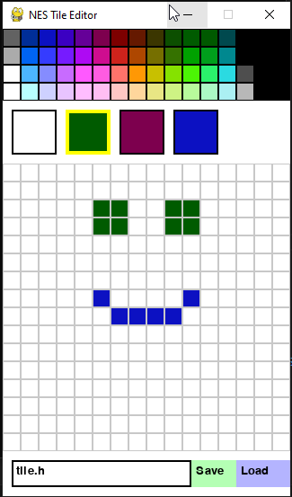

- [GameConsole](#gameconsole)
  - [Development Board](#development-board)
  - [Naming Conventions](#naming-conventions)
  - [Pinning](#pinning)
    - [USART2 (Debug Interface - Baud 921600)](#usart2-debug-interface---baud-921600)
    - [DAC (Audio)](#dac-audio)
    - [SPI1 (Display ILI9341)](#spi1-display-ili9341)
    - [ADC1 (Analog Joysticks)](#adc1-analog-joysticks)
    - [GPIO (Button Joysticks)](#gpio-button-joysticks)
    - [SD-CARD (Builtin)](#sd-card-builtin)
  - [Tile Creator](#tile-creator)
    - [Script](#script)
    - [Deps](#deps)
    - [User inputs:](#user-inputs)
    - [Usage](#usage)
  - [API \& Internal Documentation](#api--internal-documentation)
  - [Game Creation Setup](#game-creation-setup)


# GameConsole
## Development Board
https://stm32-base.org/boards/STM32F407VET6-STM32-F4VE-V2.0.html

## Naming Conventions 

| Element              | Suggested Case          | Example                                     |
| -------------------- | ----------------------- | ------------------------------------------- |
| **Macros/Defines**   | UPPER_SNAKE_CASE        | `#define MAX_BUFFER_SIZE 256`               |
| **Constants**        | UPPER_SNAKE_CASE        | `const int DEFAULT_TIMEOUT`                 |
| **Global variables** | g_snake_case            | `g_system_initialized`                      |
| **Static globals**   | s_snake_case            | `s_buffer_index`                            |
| **Local variables**  | snake_case              | `temp_value`                                |
| **Functions**        | snake_case or camelCase | `init_peripherals()` or `initPeripherals()` |
| **Struct types**     | PascalCase              | `typedef struct SensorData`                 |
| **Enum types**       | PascalCase              | `typedef enum PowerState`                   |
| **Struct members**   | snake_case              | `uint16_t adc_value;`                       |
| **Typedefs**         | PascalCase              | `typedef uint8_t Byte;`                     |

## Pinning
### USART2 (Debug Interface - Baud 921600) 
1. PA2 (TX - AF7)
2. PA3 (RX - AF7)

### DAC (Audio) 
1. PA4 (DAC1_OUT - Buzzer)
   
### SPI1 (Display ILI9341) 
1. PA5 (SCK - AF5)  - Yellow
2. PA6 (MISO - AF5) - Red
3. PA7 (MOSI - AF5) - Green
4. PA9 (DC - Normal GPIO AF) - Blue
5. PC7 (RST - Normal GPIO AF)- Purple
6. PB6 (CS - Normal GPIO AF) - Gray

### ADC1 (Analog Joysticks)
1. PC0 (ADC123_IN10 - Left Joystick X axis)
2. PC1 (ADC123_IN11 - Left Joystick Y axis)
3. PC2 (ADC123_IN12 - Right Joystick X axis)
4. PC3 (ADC123_IN13 - Right Joystick Y axis)

### GPIO (Button Joysticks)
1. PE7 (Right D-Pad UP)
2. PE8 (Right D-Pad RIGHT)
3. PE9 (Right D-Pad DOWN)
4. PE10 (Right D-Pad LEFT)
5. PE11 (Left D-Pad UP)
6. PE12 (Left D-Pad RIGHT)
7. PE13 (Left D-Pad DOWN)
8. PE14 (Left D-Pad LEFT)
9. PB11 (Special Button 1)
10. PB12 (Special Button 2)

### SD-CARD (Builtin)
1. PC10 (DAT2)
2. PC11 (CD/DAT3)
3. PD2 (CMD)
4. PC12 (CLK)
5. PC8 (DAT0)
6. PC9 (DAT1)


## Tile Creator

### Script
tile_creator.py

### Deps
pygame

### User inputs:
1. Left click draw
2. Right click clear
3. RCtrl S -> save(by textbox name)
4. RCtrl L -> load(by textbox name)

### Usage
Click on the 4 big squares to select the palette with which to draw (1st one is always the transparent one)
After you selected a palette you can also change its color from the top grid containing the system palette

Output directory: generated_tiles/



E.g output

```c++
#ifndef __bricks1_H
#define __bricks1_H
#include "tileCreator.h"
const uint8_t bricks1_data[64U] = DEFINE_TILE(
	2, 2, 2, 2, 1, 2, 2, 2, 2, 2, 2, 1, 2, 2, 2, 2, 
	1, 1, 1, 1, 1, 1, 1, 1, 1, 1, 1, 1, 1, 2, 2, 2, 
	3, 1, 3, 3, 3, 3, 3, 3, 3, 3, 3, 1, 3, 1, 1, 1, 
	2, 1, 2, 1, 2, 2, 2, 2, 2, 2, 2, 1, 2, 3, 3, 3, 
	2, 1, 2, 2, 2, 2, 2, 2, 1, 2, 2, 1, 2, 2, 2, 2, 
	1, 1, 1, 1, 1, 1, 1, 1, 1, 1, 1, 1, 1, 2, 2, 2, 
	3, 3, 3, 3, 1, 3, 3, 3, 3, 3, 3, 2, 1, 1, 1, 1, 
	2, 2, 2, 2, 1, 3, 2, 2, 2, 2, 2, 2, 2, 1, 3, 3, 
	2, 2, 2, 2, 1, 2, 2, 2, 2, 2, 2, 2, 2, 1, 3, 2, 
	1, 1, 1, 1, 1, 1, 1, 1, 1, 1, 1, 1, 2, 1, 2, 2, 
	3, 1, 3, 3, 3, 3, 3, 3, 3, 3, 3, 1, 1, 1, 1, 1, 
	2, 1, 3, 2, 2, 2, 2, 2, 1, 2, 2, 1, 3, 3, 3, 3, 
	2, 1, 3, 2, 2, 2, 2, 2, 2, 2, 2, 1, 3, 2, 2, 2, 
	1, 1, 1, 1, 1, 1, 1, 1, 1, 1, 1, 1, 2, 2, 2, 2, 
	3, 3, 3, 3, 1, 3, 3, 3, 3, 2, 3, 1, 1, 1, 1, 1, 
	2, 2, 2, 2, 1, 2, 2, 2, 2, 2, 2, 2, 2, 1, 3, 3);
const uint8_t bricks1_palette[4U] = {0x30, 0x7, 0x17, 0x27};
#endif
#endif

```

## API & Internal Documentation

See [API_README.md](API_README.md) for a full API reference, module internals, renderer usage, and advanced graphics documentation.


## Game Creation Setup

To create a new game for the GameConsole platform, follow these steps:

1. **Use the Provided Linker Script**
   - In your game's Makefile, set the linker script to `../game.ld`.
   - This ensures your game binary is laid out with the correct memory regions and symbols for the loader.

2. **Include the Console API Header**
   - Add `#include "game_console_api.h"` to your main source file.
   - This gives you access to the Console API and asset macros.

3. **Declare the API Header Pointer**
   - Add the following to your main file:
     ```c
     extern ConsoleAPIHeader __game_console_api_start; // Provided by the loader
     ConsoleAPIHeader *api_hdr_ptr = (ConsoleAPIHeader *)&__game_console_api_start;
     ```
   - This allows you to call any API function, e.g.:
     ```c
     api_hdr_ptr->api.debugString("Hello from my game!\r\n");
     ```

4. **Define the Game Header**
   - At the end of your main file, define the `GameBinaryHeader` in `(".game_header")` dedicated section:
     ```c
     extern uint32_t __game_header_start, __game_header_end;
     extern uint32_t __game_text_start, __game_text_end;
     extern uint32_t __game_ro_data_start, __game_ro_data_end;
     extern uint32_t __game_data_init_start, __game_data_init_end;
     extern uint32_t __game_data_no_init_start, __game_data_no_init_end;
     extern uint32_t __game_code_assets_start, __game_code_assets_end;

     __attribute__((section(".game_header")))
     const GameBinaryHeader game_header = {
         .magic = 0x47414D45, // 'GAME'
         .header_start = (uint32_t)&__game_header_start,
         .header_end = (uint32_t)&__game_header_end,
         .text_start = (uint32_t)&__game_text_start,
         .text_end = (uint32_t)&__game_text_end,
         .ro_data_start = (uint32_t)&__game_ro_data_start,
         .ro_data_end = (uint32_t)&__game_ro_data_end,
         .data_start = (uint32_t)&__game_data_init_start,
         .data_end = (uint32_t)&__game_data_init_end,
         .bss_start = (uint32_t)&__game_data_no_init_start,
         .bss_end = (uint32_t)&__game_data_no_init_end,
         .assets_start = (uint32_t)&__game_code_assets_start,
         .assets_end = (uint32_t)&__game_code_assets_end,
         .entry_point = (uint32_t)&main
     };
     ```
   - This header is required for the loader recognize the memory layout of the game, and load its necessary data.

5. **Add Assets**
   - Use the asset macros from `game_console_api.h` and asset IDs/types from your game to define assets in your game binary.
   - Start by defining the asset header (required for asset discovery):
     ```c
     DEFINE_ASSET_HEADER(ASSET_MAGIC, ASSET_VERSION, ASSET_COUNT);
     ```
   - Then, define each asset using the provided macros and IDs/types
     ```c
     // Example: Define a font asset (see assets.h for IDs/types)
     DEFINE_ASSET_8(font_a, ASSET_ID_FONT_A, ASSET_TYPE_FONT, { /* font data here */ });
     // Example: Define an audio data asset
     DEFINE_ASSET_16(audio_data, ASSET_ID_AUDIO_DATA, ASSET_TYPE_AUDIO_DATA, { /* audio data here */ });
     // Example: Define an audio duration asset
     DEFINE_ASSET_16(audio_duration, ASSET_ID_AUDIO_DURATION, ASSET_TYPE_AUDIO_DURATION, { /* duration data here */ });
     ```
	 Important: All assets stored with `DEFINE_ASSET` macros are lazy loaded on runtime via the `assetLoader` api functions. By doing this you can have more assets that can fit in the console text/data memory at once.

    In case of tile data generated with the `tile_creator` you can use the output define directly into the `DEFINE_ASSET_8` macro

    ```c
   DEFINE_ASSET_8(font_a, ASSET_ID_FONT_A, ASSET_TYPE_TILE, (DEFINE_FONT_A_TILE));
    ```


6. **Build and Deploy**
   - Build your game using the provided Makefile.
   - Deploy the resulting `.bin` file to the SD card main directory

---