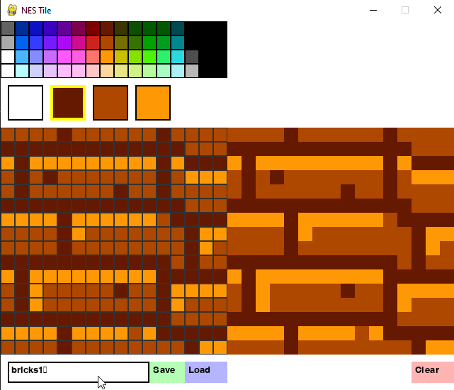

- [GameConsole](#gameconsole)
	- [Development Board](#development-board)
	- [Naming Conventions](#naming-conventions)
	- [Pinning](#pinning)
		- [USART2 (Debug Interface - Baud 921600)](#usart2-debug-interface---baud-921600)
		- [DAC (Audio)](#dac-audio)
		- [SPI1 (Display ILI9341)](#spi1-display-ili9341)
		- [ADC1 (Analog Joysticks)](#adc1-analog-joysticks)
		- [GPIO (Button Joysticks)](#gpio-button-joysticks)
		- [SD-CARD (Builtin)](#sd-card-builtin)
	- [Tile Creator](#tile-creator)
		- [Script](#script)
		- [Deps](#deps)
		- [User inputs:](#user-inputs)
		- [Usage](#usage)
	- [Renderer Engine](#renderer-engine)
		- [System Palette](#system-palette)
		- [Z-order rendering of sprites and background](#z-order-rendering-of-sprites-and-background)


# GameConsole
## Development Board
https://stm32-base.org/boards/STM32F407VET6-STM32-F4VE-V2.0.html

## Naming Conventions 

| Element              | Suggested Case          | Example                                     |
| -------------------- | ----------------------- | ------------------------------------------- |
| **Macros/Defines**   | UPPER_SNAKE_CASE        | `#define MAX_BUFFER_SIZE 256`               |
| **Constants**        | UPPER_SNAKE_CASE        | `const int DEFAULT_TIMEOUT`                 |
| **Global variables** | g_snake_case            | `g_system_initialized`                      |
| **Static globals**   | s_snake_case            | `s_buffer_index`                            |
| **Local variables**  | snake_case              | `temp_value`                                |
| **Functions**        | snake_case or camelCase | `init_peripherals()` or `initPeripherals()` |
| **Struct types**     | PascalCase              | `typedef struct SensorData`                 |
| **Enum types**       | PascalCase              | `typedef enum PowerState`                   |
| **Struct members**   | snake_case              | `uint16_t adc_value;`                       |
| **Typedefs**         | PascalCase              | `typedef uint8_t Byte;`                     |

## Pinning
### USART2 (Debug Interface - Baud 921600) 
1. PA2 (TX - AF7)
2. PA3 (RX - AF7)

### DAC (Audio) 
1. PA4 (DAC1_OUT - Buzzer)
   
### SPI1 (Display ILI9341) 
1. PA5 (SCK - AF5)  - Yellow
2. PA6 (MISO - AF5) - Red
3. PA7 (MOSI - AF5) - Green
4. PA9 (DC - Normal GPIO AF) - Blue
5. PC7 (RST - Normal GPIO AF)- Purple
6. PB6 (CS - Normal GPIO AF) - Gray

### ADC1 (Analog Joysticks)
1. PC0 (ADC123_IN10 - Left Joystick X axis)
2. PC1 (ADC123_IN11 - Left Joystick Y axis)
3. PC2 (ADC123_IN12 - Right Joystick X axis)
4. PC3 (ADC123_IN13 - Right Joystick Y axis)

### GPIO (Button Joysticks)
1. PE7 (Right D-Pad UP)
2. PE8 (Right D-Pad RIGHT)
3. PE9 (Right D-Pad DOWN)
4. PE10 (Right D-Pad LEFT)
5. PE11 (Left D-Pad UP)
6. PE12 (Left D-Pad RIGHT)
7. PE13 (Left D-Pad DOWN)
8. PE14 (Left D-Pad LEFT)
9. PB11 (Special Button 1)
10. PB12 (Special Button 2)

### SD-CARD (Builtin)
1. PC10 (DAT2)
2. PC11 (CD/DAT3)
3. PD2 (CMD)
4. PC12 (CLK)
5. PC8 (DAT0)
6. PC9 (DAT1)


## Tile Creator

### Script
tile_creator.py

### Deps
pygame

### User inputs:
1. Left click draw
2. Right click clear
3. RCtrl S -> save(by textbox name)
4. RCtrl L -> load(by textbox name)

### Usage
Click on the 4 big squares to select the palette with which to draw (1st one is always the transparent one)
After you selected a palette you can also change its color from the top grid containing the system palette

Output directory: generated_tiles/



E.g output

```c++
#ifndef __bricks1_H
#define __bricks1_H
#include "tileCreator.h"
const uint8_t bricks1_data[64U] = DEFINE_TILE_16(
	2, 2, 2, 2, 1, 2, 2, 2, 2, 2, 2, 1, 2, 2, 2, 2, 
	1, 1, 1, 1, 1, 1, 1, 1, 1, 1, 1, 1, 1, 2, 2, 2, 
	3, 1, 3, 3, 3, 3, 3, 3, 3, 3, 3, 1, 3, 1, 1, 1, 
	2, 1, 2, 1, 2, 2, 2, 2, 2, 2, 2, 1, 2, 3, 3, 3, 
	2, 1, 2, 2, 2, 2, 2, 2, 1, 2, 2, 1, 2, 2, 2, 2, 
	1, 1, 1, 1, 1, 1, 1, 1, 1, 1, 1, 1, 1, 2, 2, 2, 
	3, 3, 3, 3, 1, 3, 3, 3, 3, 3, 3, 2, 1, 1, 1, 1, 
	2, 2, 2, 2, 1, 3, 2, 2, 2, 2, 2, 2, 2, 1, 3, 3, 
	2, 2, 2, 2, 1, 2, 2, 2, 2, 2, 2, 2, 2, 1, 3, 2, 
	1, 1, 1, 1, 1, 1, 1, 1, 1, 1, 1, 1, 2, 1, 2, 2, 
	3, 1, 3, 3, 3, 3, 3, 3, 3, 3, 3, 1, 1, 1, 1, 1, 
	2, 1, 3, 2, 2, 2, 2, 2, 1, 2, 2, 1, 3, 3, 3, 3, 
	2, 1, 3, 2, 2, 2, 2, 2, 2, 2, 2, 1, 3, 2, 2, 2, 
	1, 1, 1, 1, 1, 1, 1, 1, 1, 1, 1, 1, 2, 2, 2, 2, 
	3, 3, 3, 3, 1, 3, 3, 3, 3, 2, 3, 1, 1, 1, 1, 1, 
	2, 2, 2, 2, 1, 2, 2, 2, 2, 2, 2, 2, 2, 1, 3, 3);
const uint8_t bricks1_palette[4U] = {0x30, 0x7, 0x17, 0x27};
#endif
#endif

```

## Renderer Engine
### System Palette


### Z-order rendering of sprites and background
| rendererOamSetPriorityLow | rendererAttributeTableSetPriorityHigh | Order of elements         | Explanation                                |
| ------------------------- | ------------------------------------- | ------------------------- | ------------------------------------------ |
| true                      | false/true                            | Bg Low - Bg High - Sprite | Sprite will always be on top               |
| false                     | false                                 | Bg Low - Sprite           | Sprite is drawn over low priority BG       |
| false                     | true                                  | Sprite - Bg High          | Sprite is drawn under the high priority BG |


