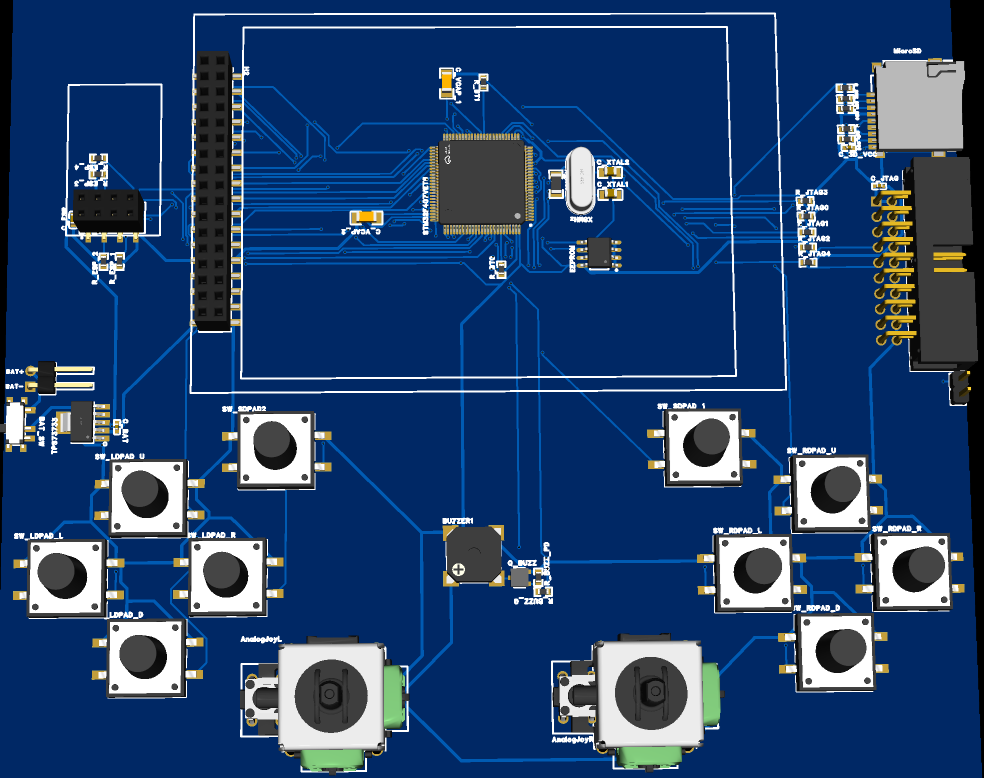

- [Hardware needed](#hardware-needed)
- [Console board schematic](#console-board-schematic)
- [Pinning](#pinning)
  - [JTAG / SWD / SWO (Debug Interface)](#jtag--swd--swo-debug-interface)
  - [TIM3 (Audio/Buzzer)](#tim3-audiobuzzer)
  - [FSMC 16-bit (Display ILI9341 - 8080 Parallel)](#fsmc-16-bit-display-ili9341---8080-parallel)
  - [ADC1 (Analog Joysticks)](#adc1-analog-joysticks)
  - [GPIO (Button Joysticks)](#gpio-button-joysticks)
  - [GPIO (Debug Pins)](#gpio-debug-pins)
  - [SD-CARD (Builtin)](#sd-card-builtin)
  - [I2C1 EEPROM Console Settings Storage](#i2c1-eeprom-console-settings-storage)
  - [ESP01 - USART1 (Network Communication)](#esp01---usart1-network-communication)
- [EEPROM address](#eeprom-address)

## Hardware needed
1. STM32F407VET6 development board
2. ILI9341 240x320 3.2" FSMC 16bit 8080  Waveshare 16498 display
3. Passive Buzzer
4. 10 push buttons
5. 2 analog joysticks with 2 axes
6. ESP-01
7. AT24C512 64kb I2C EEPROM module
8. 1 microSD card reader and microSD card FAT32 formatted

## Console board schematic
Hardware design resources  `projectRoot/docu/HW/`

## Pinning

### JTAG / SWD / SWO (Debug Interface)
1. PA13 (JTMS / SWDIO)
2. PA14 (JTCK / SWCLK)
3. PA15 (JTDI)
4. PB3 (JTDO / TRACESWO)
5. PB4 (NJTRST)

### TIM3 (Audio/Buzzer)
1. PB5 (TIM3_CH2 - AF2)

### FSMC 16-bit (Display ILI9341 - 8080 Parallel)
1. PD14 (FSMC_D0 - AF12)
2. PD15 (FSMC_D1 - AF12)
3. PD0 (FSMC_D2 - AF12)
4. PD1 (FSMC_D3 - AF12)
5. PE7 (FSMC_D4 - AF12)
6. PE8 (FSMC_D5 - AF12)
7. PE9 (FSMC_D6 - AF12)
8. PE10 (FSMC_D7 - AF12)
9. PE11 (FSMC_D8 - AF12)
10. PE12 (FSMC_D9 - AF12)
11. PE13 (FSMC_D10 - AF12)
12. PE14 (FSMC_D11 - AF12)
13. PE15 (FSMC_D12 - AF12)
14. PD8 (FSMC_D13 - AF12)
15. PD9 (FSMC_D14 - AF12)
16. PD10 (FSMC_D15 - AF12)
17. PD4 (FSMC_NOE / LCD_RD - AF12)
18. PD5 (FSMC_NWE / LCD_WR - AF12)
19. PD7 (FSMC_NE1 / LCD_CS - AF12)
20. PD11 (FSMC_A16 / LCD_DC - AF12)
21. PC7 (LCD_RST - Normal GPIO)
22. PA3  (LCD_BL - TIM9_CH2 PWM / backlight brightness - AF3)

### ADC1 (Analog Joysticks)
1. PC0 (ADC123_IN10 - Left Joystick X axis)
2. PC1 (ADC123_IN11 - Left Joystick Y axis)
3. PC2 (ADC123_IN12 - Right Joystick X axis)
4. PC3 (ADC123_IN13 - Right Joystick Y axis)

### GPIO (Button Joysticks)
1. PA0 (Right D-Pad UP)
2. PA1 (Right D-Pad RIGHT)
3. PA5 (Right D-Pad DOWN)
4. PA6 (Right D-Pad LEFT)
5. PA7 (Left D-Pad UP)
6. PA8 (Left D-Pad RIGHT)
7. PA11 (Left D-Pad DOWN)
8. PA12 (Left D-Pad LEFT)
9. PB11 (Special Button 1)
10. PB12 (Special Button 2)

### SD-CARD (Builtin)
1. PC10 (DAT2 - AF12 PU)
2. PC11 (CD/DAT3 - AF12 PU)
3. PD2 (CMD - AF12 PU)
4. PC12 (CLK - AF12)
5. PC8 (DAT0 - AF12 PU)
6. PC9 (DAT1 - AF12 PU)
7. PD3 (SD CD(card detect) - PU)

> **V2 PCB SD-card reliability note.** The V2 board is a 2-layer PCB with no ground plane and only a 100 nF decoupling cap at the microSD VDD (no bulk capacitance). Under sustained SDIO traffic the card browns out on write-current transients, so writes can verify warm yet read back corrupt cold, and boot reads intermittently time out (a clean boot ranges from ~2 s to 40 s+). This is a board-level power/ground-integrity limit, not firmware — no clock, bus-width, or timing setting fixes it. The fix is the next PCB revision: a solid ground plane and a 10 µF bulk cap in parallel with the 100 nF right at the card VDD pin, with short/wide VDD+GND back to the plane. Until then the firmware contains it as far as it can (download CRC + per-block read-back-verify-with-retry).

### I2C1 EEPROM Console Settings Storage
1. PB8 (I2C1_SCL - AF4 PU)
2. PB9 (I2C1_SDA - AF4 PU)

### ESP01 - USART1 (Network Communication)
Runtime link runs at **923076 baud** (`NETWORK_UART_BAUD`); **115200** (`USART1_DEFAULT_BAUD`) is used only when reflashing the ESP-01 over its ROM bootloader.

1. PA9 (TX - AF7) - USART1
2. PA10 (RX - AF7) - USART1
3. PB10 (EN - normal GPIO)
4. PB6 (RST - normal GPIO)
5. PC6 (IO0 - normal GPIO)
6. PC13 (IO2 - normal GPIO)

### GPIO (Debug Pins)
Board pads only — the firmware does not configure or drive these (`gpioInit` leaves them at their reset state).
1. PB1 (Debug Pin 1)
2. PB2 (Debug Pin 2)

## EEPROM address
AT24C512_ADDRESS 0x50U (80)
