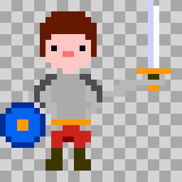
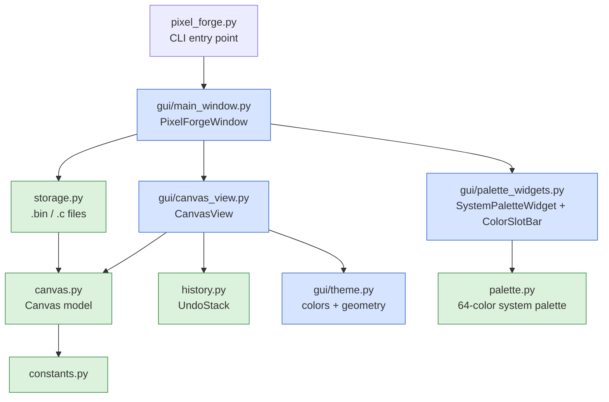

# Pixel Forge

A pixel-art editor for GameConsole graphics. It produces pictures of any
width/height in the console's 2bpp or 4bpp indexed-color formats, exported
as a `GfxAsset` `.bin` (loadable save state + runtime asset) and a
human-readable `.c` companion.

## Features

- **Free-form canvas**: width and height are independent (a picture is not
  a tile); grow or shrink the canvas at any time, content stays anchored
  top-left.
- **Two formats**: 2bpp (3 colors + transparent) or 4bpp (15 colors +
  transparent), switchable while editing. Slot colors survive a round trip
  through 2bpp, so toggling formats is non-destructive for the palette.
- **System palette**: the console's 64-color palette at the top; click a
  drawing slot, then a system color to reassign it. Slot 0 is always the
  transparent/background slot — its color sets the backdrop, and a
  **Checker BG** toggle switches the preview between the transparency
  checkerboard and that color. **Reset palette** restores the default slot
  colors (undoable).
- **Undo/redo**: memento-based; pixel strokes, palette edits, resizes and
  format switches all undo uniformly (one stroke = one step).
- **Dual output**: a `.bin` (save state + asset) and a `.c` companion.

## Requirements

Python 3 with **PyQt6** (`apt install python3-pyqt6`).

## Usage

```bash
python3 pixel_forge.py                          # 32×32 2bpp, files in the current directory
python3 pixel_forge.py -o <dir> -f <name>       # custom output dir / start file
python3 pixel_forge.py --width 64 --height 48   # initial canvas size
python3 pixel_forge.py --format 4bpp            # initial format
```

The file dropdown lists every `.bin` in the output directory (default: the
directory the tool is started from); pick one to load it, or `<New Name>`
to type a fresh name. If the start file already exists it is loaded on
launch (its size/format override the command line).

There is also a **Pixel Forge** launch configuration in `.vscode/launch.json`.

An example picture ships in [`Assets/Gfx`](../../Assets/Gfx) — a 32×32 4bpp
hero with sword and shield (`hero.bin` / `hero.c`). Open it with
`python3 pixel_forge.py -o ../../Assets/Gfx -f hero`:



### Mouse

| Action                  | Effect                                       |
| ----------------------- | -------------------------------------------- |
| Left click / drag       | Paint with the active slot                   |
| Right click             | Erase the pixel (click without dragging)     |
| Right click + drag      | Pan the view in any direction                |
| Click a slot swatch     | Make it the active drawing color             |
| Click a system color    | Assign it to the active slot (slot 0 = background color) |
| Ctrl + wheel            | Zoom (anchored at the mouse)                 |
| Wheel / scrollbars      | Scroll the canvas                            |

### Keyboard

| Key(s)                         | Effect                          |
| ------------------------------ | ------------------------------- |
| `Ctrl+Z` / `Ctrl+Y`            | Undo / redo                     |
| `Ctrl+=` / `Ctrl+-` / `Ctrl+0` | Zoom in / out / reset           |
| `Ctrl+S` / `Ctrl+L`            | Save / load                     |

### Controls

- **Format**: the export format. Narrowing to 2bpp asks for confirmation if
  drawn pixels use slots above 3 (they become transparent).
- **Checker BG**: how transparent (slot 0) pixels are previewed — as a
  checkerboard (default) or filled with the slot-0 background color.
  View-only; the exported data is identical either way.
- **Reset palette**: restores all slot colors to the defaults (undoable).
- **Size + Resize**: type a new width/height and press Resize to add (or
  remove) columns/rows; shrinking asks for confirmation if it would cut off
  drawn pixels.
- **Clear**: empties the canvas (undoable, asks first).

## Output Formats

### `<name>.bin`

A `GfxAssetHeader` followed by the payload, all little-endian. The structs
are declared in [`gfx_asset.h`](gfx_asset.h) so C projects can import the
format directly:

```c
#define GFX_FLAG_OPAQUE 0x1U // picture has no transparent (slot 0) pixels

typedef enum
{
    GFX_FMT_2BPP = 1,
    GFX_FMT_4BPP = 2,
} GfxFormat;

typedef struct __attribute__((packed))
{
    uint32_t magic;    // "GFX1"
    uint32_t width;    // pixels
    uint32_t height;   // pixels
    uint32_t format;   // GfxFormat
    uint32_t dataSize; // pixel data bytes after this header
    uint32_t flags;    // GFX_FLAG_* bitmask
} GfxAssetHeader;

typedef struct __attribute__((packed))
{
    GfxAssetHeader header;
    uint8_t data[]; // header.dataSize pixel bytes
} GfxAsset;
```

The file layout:

```
[GfxAssetHeader]
[pixel rows]  dataSize bytes, row-major, each row padded to a whole byte
              2bpp: 4 px/byte, leftmost pixel in the highest bits
              4bpp: 2 px/byte, leftmost pixel in the high nibble
[palette]     one byte per color (a system palette index 0-63), 4 entries
              for 2bpp or 16 for 4bpp; entry 0 is the transparent /
              background slot, its stored color is the picture's
              suggested backdrop color
```

`flags` is set automatically at export time: `GFX_FLAG_OPAQUE` is raised when
the picture uses no slot-0 (transparent) pixels, so a consumer can pick the
fast opaque blit. (Files written before the `flags` word existed have a
four-int header and still load.)

The start of the file maps onto `GfxAsset` (header + pixel data); the
palette block follows at `sizeof(GfxAssetHeader) + dataSize`. Row stride is
`ceil(width * bpp / 8)` bytes.

### `<name>.c`

A human-readable companion to the `.bin` (the `.bin` is the file meant for
actual use):

```c
// Generated by pixel_forge.py - do not edit manually
#include "gfx_asset.h"

#define LOGO_WIDTH 10U
#define LOGO_HEIGHT 6U
#define LOGO_DATA_SIZE 30U

const GfxAssetHeader logo_gfx_header = {
    .magic = GFX_ASSET_MAGIC,
    .width = LOGO_WIDTH,
    .height = LOGO_HEIGHT,
    .format = GFX_FMT_4BPP,
    .dataSize = LOGO_DATA_SIZE,
    .flags = GFX_FLAG_OPAQUE, // or 0 when the picture has transparent pixels
};

// system palette indices (slot 0 is transparent, its color is the backdrop)
const uint8_t logo_gfx_palette[GFX_PALETTE_COLORS_4BPP] = {
    0x20, 0x0A, 0x05, 0x02, /* ... */
};

// pixels: 4bpp, 5 byte(s) per row
const uint8_t logo_gfx_data[LOGO_DATA_SIZE] = {
    0xF0, 0x00, 0x00, 0x00, 0x00, // row 0
    /* ... */
};
```

## Architecture

The code is split into a Qt-free core (testable without a display) and a
thin GUI layer:



| Module                   | Responsibility                                                              | Depends on Qt |
| ------------------------ | --------------------------------------------------------------------------- | ------------- |
| `constants.py`           | Format/flag values, limits, defaults                                        | no            |
| `palette.py`             | The console's 64-color system palette (RGB)                                 | no            |
| `canvas.py`              | `Canvas` domain model: pixels, palette slots, format, resize, mementos      | no            |
| `history.py`             | `UndoStack`: memento-based undo/redo with burst coalescing                  | no            |
| `storage.py`             | 2bpp/4bpp packing, `.bin` serialization, `.c` generation, output listing    | no            |
| `gui/theme.py`           | Geometry and color constants, transparency checkerboard                     | yes           |
| `gui/palette_widgets.py` | System palette grid + drawing slot bar (passive views)                      | yes           |
| `gui/canvas_view.py`     | The drawable canvas; owns the `Canvas` + `UndoStack`, paints strokes        | yes           |
| `gui/confirm.py`         | In-window Yes/No overlay (centered on all platforms, incl. Wayland)         | yes           |
| `gui/main_window.py`     | Window layout, format/size/zoom controls, file UI, control/canvas sync      | yes           |
| `pixel_forge.py`         | Argument parsing, wiring, app lifecycle                                     | yes           |

Design decisions:

- **Mutators report changes**: every `Canvas` mutator returns True only when
  it changed something, so `CanvasView` records undo snapshots for real
  changes only and "Nothing to undo" stays truthful.
- **Undo covers everything**: size, format, palette and pixels live in one
  memento, so undoing past a resize or format switch just works; the main
  window re-syncs all controls from the canvas after every change.
- **16 palette slots always**: the format only limits how many slots are
  *usable*, so 2bpp → 4bpp → 2bpp keeps the upper slot colors.
- **`.bin` as save state**: one format for persistence and for the console
  keeps load/save trivially round-trippable (the palette block makes the
  file self-contained).

## Development

Quick headless smoke test:

```bash
cd tools/graphics
python3 -c "
from pixelforge.canvas import Canvas
from pixelforge import storage
from pixelforge.constants import GFX_FMT_2BPP
import tempfile, os
c = Canvas(5, 3, GFX_FMT_2BPP)
c.set(0, 0, 3); c.set(4, 2, 1)
assert storage.unpack_pixels(storage.pack_pixels(c), 5, 3, 2) == c.pixels
with tempfile.TemporaryDirectory() as d:
    storage.save_bin(c, os.path.join(d, 't.bin'))
    assert storage.load_bin(os.path.join(d, 't.bin')).pixels == c.pixels
print('OK')"
```

Widget tests run with `QT_QPA_PLATFORM=offscreen`.
