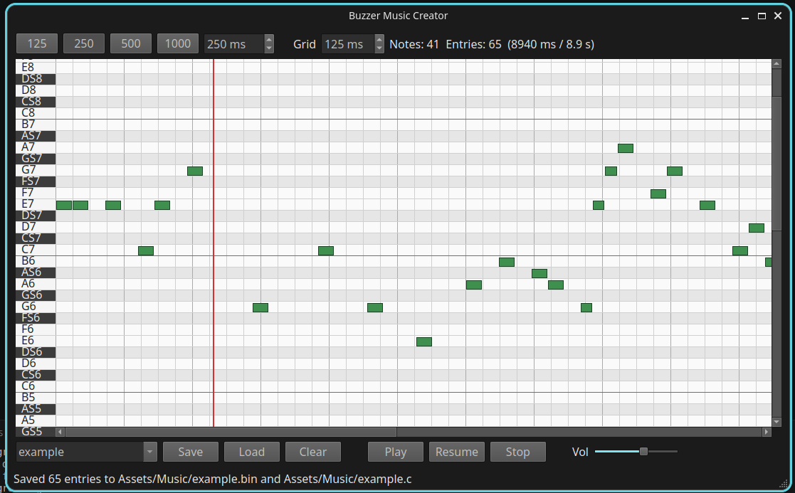
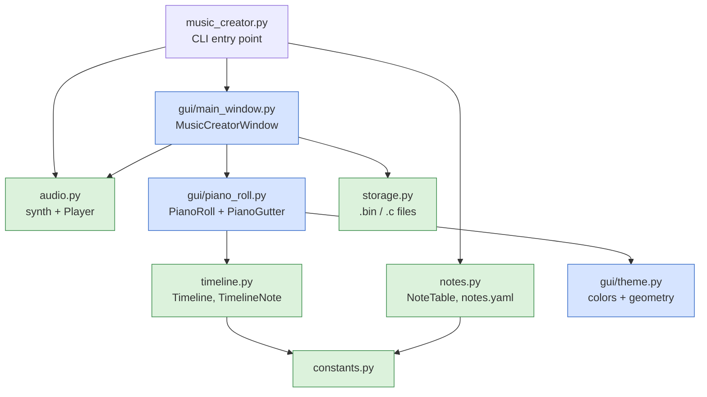
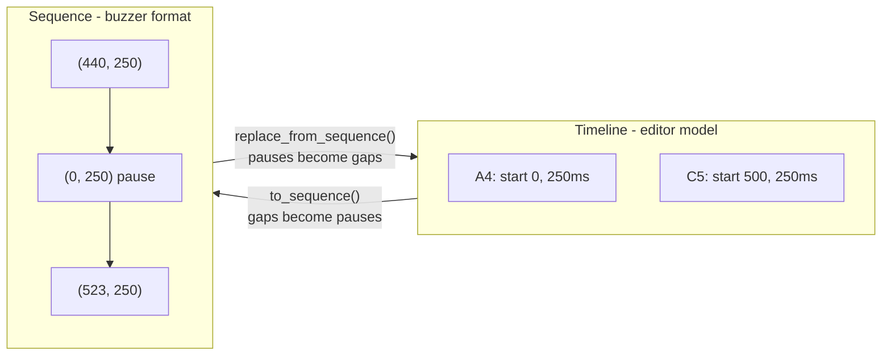
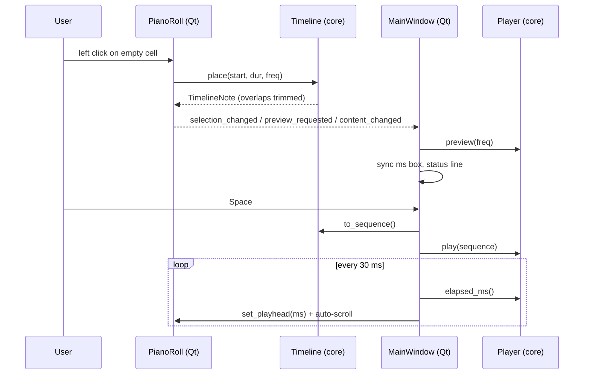

# Buzzer Music Creator


A piano-roll editor for composing buzzer music. It produces note sequences
as interleaved little-endian `uint16` pairs, 4 bytes per note:

```
frequency_hz, duration_ms, frequency_hz, duration_ms, ...
```

A frequency of `0` is a pause. The same format is written both as a raw
`.bin` file and as a `uint16_t` array in a `.c` file (see Output Formats).



## Features

- **Piano-roll grid**: pitch on the Y axis (piano keys on the left), time on
  the X axis. Like classic 8-bit trackers.
- **Implicit pauses**: empty grid space between notes automatically becomes
  `PAUSE` (frequency 0) entries in the exported sequence.
- **Authentic playback**: square-wave synthesis approximating the buzzer,
  with playhead, pause/resume, and volume control.
- **Keyboard-first entry**: place notes without touching the mouse.
- **Dual output**: a `.bin` (loadable save state + runtime asset) and a `.c`
  array ready to compile into a game.

## Requirements

- Python 3 with **PyQt6** (`apt install python3-pyqt6`), **pygame**,
  **numpy**, and **PyYAML**.

## Usage

```bash
python3 music_creator.py                      # output to ./Assets/Music, name "music"
python3 music_creator.py -o <dir> -f <name>   # custom output dir / start file
python3 music_creator.py --notes-yaml <file>  # alternative note set
```

There is also a **Music Creator** launch configuration in `.vscode/launch.json`.

An example track ships with the tool — open it with
`python3 music_creator.py -o . -f example` and press Space.

### Mouse

| Action                    | Effect                                        |
| ------------------------- | --------------------------------------------- |
| Left click empty cell     | Place a note at that pitch/time (previews it) |
| Left click + drag right   | Stretch the note being placed                 |
| Left click a note         | Select it (orange); ms box edits its length   |
| Right click a note        | Delete it                                     |
| Click a piano key (left)  | Preview that pitch                            |
| Mouse wheel / Shift+wheel | Scroll vertically / horizontally              |

### Keyboard

| Key(s)              | Effect                                                  |
| ------------------- | ------------------------------------------------------- |
| `1`–`9` `0` `-` `+` | Place C, CS, D, DS, E, F, FS, G, GS, A, AS, B at cursor |
| `Up` / `Down`       | Select octave (green bar on the piano keys)             |
| `Left` / `Right`    | Move the cursor (blue column) one grid step             |
| `P`                 | Advance the cursor, leaving a pause                     |
| `Delete`            | Delete the selected note                                |
| `Escape`            | Deselect                                                |
| `Space`             | Play / pause / resume                                   |
| `Ctrl+S` / `Ctrl+L` | Save / load                                             |

Notes placed by keyboard use the current **ms** length and advance the
cursor by their duration, so melodies can be typed in sequence.

### Controls

- **Preset buttons / ms box**: length for new notes. With a note selected,
  the ms box edits that note directly; press Enter in the box to return
  focus to keyboard note entry.
- **Grid box**: time per grid cell (snapping resolution). Changing it only
  rescales the view; note timings are kept in milliseconds.
- **File dropdown**: `<New Name>` to type a fresh name, or pick an existing
  `.bin` from the output directory. Save refreshes the list.

## Output Formats

### `<name>.bin`

Little-endian `uint16` pairs, 4 bytes per entry — identical to the array
`buzzerPlay()` consumes, and also the editor's save state:

```
offset 0: frequency_hz  (uint16 LE)   0 = pause
offset 2: duration_ms   (uint16 LE)
offset 4: frequency_hz ...
```

### `<name>.c`

```c
// Generated by music_creator.py - do not edit manually
#include <stdint.h>

#define MY_TUNE_NOTES_NUMBER 3U

const uint16_t my_tune_music[MY_TUNE_NOTES_NUMBER * 2U] = {
    440U, 250U, // A4
    0U, 250U, // PAUSE
    523U, 500U, // C5
};
```

Firmware usage:

```c
buzzerPlay(track, /*is_looped=*/false, my_tune_music, MY_TUNE_NOTES_NUMBER);
```

### `notes.yaml`

The available pitches, as `name: frequency_hz` pairs under a `notes:` key:

```yaml
notes:
  PAUSE: 0
  C4: 261
  CS4: 277
  A4: 440
  # ...
```

Rules:

- Names matching `<pitch><octave>` (`C4`, `CS4`, ... — `S` marks a sharp)
  form the piano roll rows and the octave list for keyboard entry.
- An entry with frequency `0` (conventionally `PAUSE`) never appears on the
  grid — silence is implicit — but is used to label pause entries in the
  generated `.c` files.
- Any other names are ignored by the grid but still label matching
  frequencies in the output.

The file shipped in this directory mirrors the firmware's note table; keep
the frequencies in sync with the values the console expects if you edit it.
If the file is missing the tool exits with an error — create it by hand
following the format above.

## Architecture

The code is split into a Qt-free core (testable without a display) and a
thin GUI layer:



### Module responsibilities

| Module               | Responsibility                                                                                                           | Depends on Qt |
| -------------------- | ------------------------------------------------------------------------------------------------------------------------ | ------------- |
| `constants.py`       | Shared defaults, limits, repo paths                                                                                      | no            |
| `notes.py`           | Read `notes.yaml`, `NoteTable` lookups (name ↔ frequency, octaves)                                                       | no            |
| `timeline.py`        | `Timeline`/`TimelineNote` domain model: monophonic note placement, overlap trimming, conversion to/from buzzer sequences | no            |
| `storage.py`         | `.bin` serialization, `.c` code generation, output dir listing                                                           | no            |
| `audio.py`           | Square-wave synthesis, `Player` (play/pause/resume/stop, position clock, volume)                                         | no            |
| `gui/theme.py`       | Geometry and color constants                                                                                             | yes           |
| `gui/piano_roll.py`  | `PianoRoll` (grid view/controller over a `Timeline`), `PianoGutter` (fixed key column)                                   | yes           |
| `gui/main_window.py` | Window layout, keyboard handling, transport, file UI                                                                     | yes           |
| `music_creator.py`   | Argument parsing, wiring, app lifecycle                                                                                  | yes           |

### Data model

The editor works on a **timeline** (notes with absolute start times in ms);
the firmware consumes a **sequence** (flat `(frequency, duration)` pairs
where silence is explicit). `timeline.py` converts between them losslessly:



Invariants:

- The timeline is **monophonic** (one buzzer track): placing or resizing a
  note trims/overwrites anything it overlaps (`Timeline.clear_range`).
- All durations are clamped to `uint16` (65535 ms); longer gaps are split
  into multiple pause entries on export.
- Grid snapping is a **view** concern (`PianoRoll.snap`); the model keeps
  exact millisecond values, so changing the grid step never alters data.

### Event flow



### Design decisions

- **Qt-free core**: `timeline`, `storage`, `audio`, and `notes` import no Qt
  and can be unit-tested headlessly (`QT_QPA_PLATFORM=offscreen` is only
  needed for widget tests).
- **pygame for audio, Qt for UI**: pygame.mixer runs fine without a pygame
  window and avoids a QtMultimedia dependency.
- **`.bin` as save state**: one format for persistence and for the console's
  SD-card asset keeps load/save trivially round-trippable.
- **Identity-based selection**: the roll tracks the selected `TimelineNote`
  object, not an index, so trims/sorts can't invalidate the selection
  silently.
- **Wall-clock playhead**: pygame exposes no sample-accurate position, so
  `Player` tracks `time.monotonic()` and compensates for time spent paused.

## Development

Quick headless smoke test:

```bash
cd tools/music_creator
QT_QPA_PLATFORM=offscreen SDL_AUDIODRIVER=dummy python3 -c "
from musiccreator.timeline import Timeline
t = Timeline()
t.place(0, 250, 440); t.place(500, 250, 523)
assert t.to_sequence() == [(440, 250), (0, 250), (523, 250)]
t2 = Timeline(); t2.replace_from_sequence(t.to_sequence())
assert t2.to_sequence() == t.to_sequence()
print('OK')"
```
